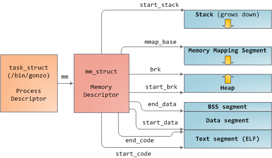
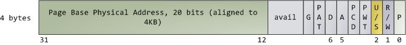
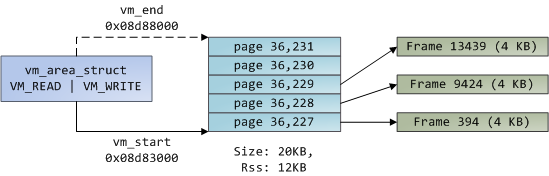

# 内核内存管理（[原文地址](https://manybutfinite.com/post/how-the-kernel-manages-your-memory/)）

## 进程描述符(process descriptor)和内存描述符(memory descriptor)

linux进程在内核中被实现为task_struct的实例；进程的内存结构由mm_struct描述，记录了进程虚地址空间每个分段的始终地址、VMA链表、基于BRTree的VMA树等。

## VMA和页表

内存描述符的两架马车：virtual memory areas、page tables

### VMA

每个VMA由连续的虚地址区间组成，这些虚地址区间不重叠。VMA由vm_area_struct描述，包括它的始终地址、权限行为标识以及映射到的文件。未映射到文件的VMA匿名。除了Memory Mapping段之外，每个内存段都唯一的对应到一个VMA。

进程的VMA集同时以两种形态存在：链表、BRTree。前者方便枚举，如：读取/proc/pid_of_process/maps时，内核只要依次遍历链表的每个节点并打印即可；BRTree使得内核能快速定位覆盖某虚拟地址的VMA。

### Page Table（页表）

虚地址空间划分为页进行管理，32位x86处理器支持的页大小为：4KB/2MB/4MB。一个VMA的大小为页大小的整数倍。3GB用户空间按照每页4KB划分如下图所示：

处理器根据页表将虚地址转为物理地址。每个进程拥有自己独立的页表，用户空间的页表随同进程一期切换。每个虚拟页都对应一个页表中的PTE（page table entry），x86分页的PTE是一个4字节的记录：

Linux可以读写PET中的标识。

* P
   标识该页在物理内存中是否已加载。若为1，表明该页已加载；否则访问该页时，发生缺页中断。
* R/W
   是否只读页。0=>只读。
* U/S
   访问权限。0=>仅内核可访问。
* D/A
  * D
   是否已被写。0=>干净。
  * A
   是否已被访问过。0=>从未访问过。

   CPU仅写D/A，内核控制D/A擦除。

* 物理地址，按照页大小对齐（4KB）
  
虚拟页是内存保护单元，~~因为同一个物理页可映射到多个拥有不同权限标识的虚拟页~~。PET中并未包含可执行权限，这也是为何经典x86分页允许执行位于栈上的代码。This lack of a PTE no-execute flag illustrates a broader fact: permission flags in a VMA may or may not translate cleanly into hardware protection. The kernel does what it can, but ultimately the architecture limits what is possible.

虚拟内存并不存储任何数据，它只简单的将进程的地址空间映射至物理内存。处理器访问物理内存，并称之为：物理地址空间。内核将物理地址空间分解成页帧（Page Frame），处理器对页帧一无所知也不关心，但页帧确实内核的物理管理单元。

Linux中，页帧由描述符和若干标识跟踪。这些描述符一起追踪了整个物理内存；页帧的精准状态是已知的。物理内存由<b>buddy memory allocation</b>技术管理，页帧空闲则表明其可被Buddy系统分配。

一个已分配的页帧，要么匿名持有程序数据，要么位于页缓存（Page Cache)，持有文件或设备。

## 总结

让我将VMA、页表和页帧贯通起来，看看它们是怎么工作的。下图为一个用户态的堆内存：

蓝色区域表示VMA中的虚拟页，箭头表示页到页帧的映射（PET)。未映射到页帧的页（无箭头）表明它们对应PET中的<b>Present</b>标识为0，也意味着这些页从未被访问过，或者已被交换出，对它们的访问会触发缺页中断（Page Fault）。

以内存分配为例：

程序请求扩展堆大小（调用brk())，内核更新VMA。此时页帧尚未分配，待后续程序访问新页时处理器缺页中断，内核寻找覆盖缺页的VMA，若寻找失败，则抛出Segmentation Fault。~~若找到且PET显示未加载，则请求RAM分配内存，创建PET，~~

When a VMA is found the kernel must handle the fault by looking at the PTE contents and the type of VMA. In our case, the PTE shows the page is not present. In fact, our PTE is completely blank (all zeros), which in Linux means the virtual page has never been mapped. Since this is an anonymous VMA, we have a purely RAM affair that must be handled by do_anonymous_page(), which allocates a page frame and makes a PTE to map the faulted virtual page onto the freshly allocated frame.

Things could have been different. The PTE for a swapped out page, for example, has 0 in the Present flag but is not blank. Instead, it stores the swap location holding the page contents, which must be read from disk and loaded into a page frame by do_swap_page() in what is called a major fault.
