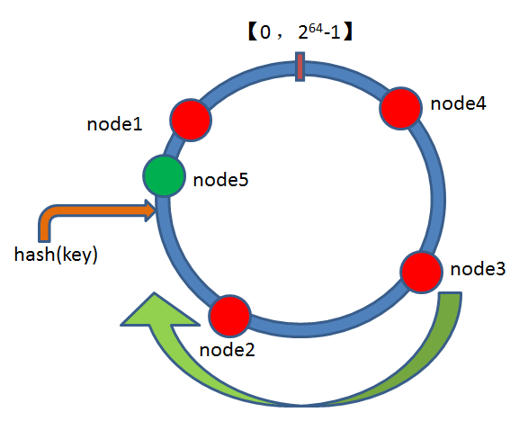
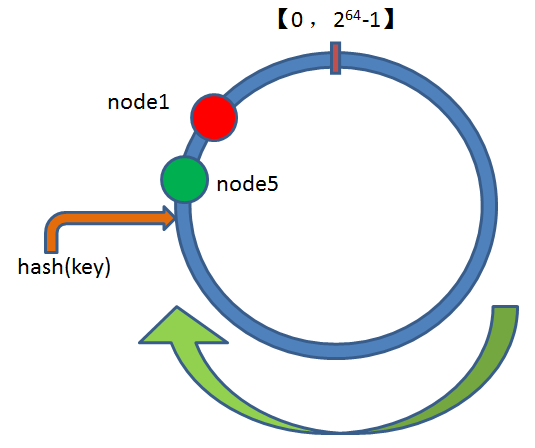
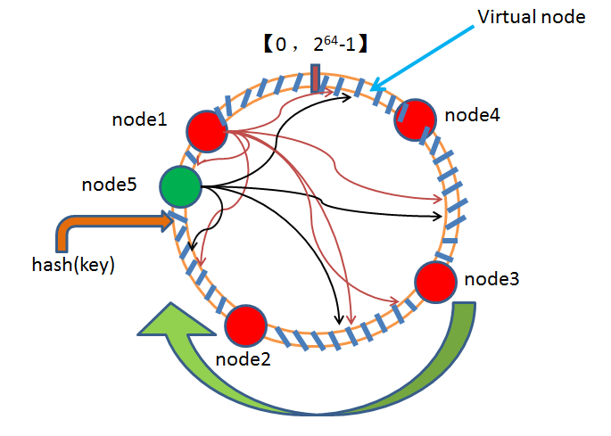

# 一致性哈希

## 哈希

* 若关键字为k，其值存放在f(k)的位置上，则称f为<b>散列函数</b>，f(k)为<b>散列地址</b>，以此思想建立的表为<b>散列表</b>。
* 对任意关键字k，f(k)始终位于某个有限的连续地址空间内。
* 对于不同的关键字k1、k2，若f(k1)=f(2)，则称该情况为<b>冲突</b>。
  若散列表长度小于关键字集合，则冲突不可避免。
* 若关键字集能等概率的散列到整个目标地址空间，则称该散列方法为<b>均匀散列函数</b>。均匀散列函数旨在减少冲突。

综上所述：根据散列函数和冲突处理方法，将关键字映射到有限的连续地址空间中，这一过程就叫<b>散列/哈希</b>。

### 散列函数、冲突处理

参考：[维基百科](https://zh.wikipedia.org/wiki/%E5%93%88%E5%B8%8C%E8%A1%A8#cite_note-%E4%BE%8B%E7%A8%8B-1)

### 常见散列算法

* md5(128bits)
* sha1(160bits)
* sha256(256bits)

## 一致性哈希

假如，按照用户的唯一ID进行散列，将用户映射到两个Redis实例，那么ID对2取模即可。随着用户规模增大，需要再加入一个Redis实例进行负载均衡，那么ID对3取模则会带来灾难性的后果：除满足ID%2==ID%3的用户之外的所有用户，都需要做数据迁移！

一致性哈希应用而生，旨在解决上述问题。

### 算法描述

如上图所示，抽象的将散列地址空间首位相接成环，将资源节点（红色节点）均匀的插入该环。按照顺时针/逆时针方向，图中环被切割为：(4, 3]、(3, 2]、(2,1]和(1,4]四段。任何关键字的散列值会唯一的落在某段，选择段尾/段首节点为落在该段的关键字的资源节点。

插入或删除资源节点仅影响其下一个相邻资源节点的数据迁移。

### 倾斜

我们能确保初始资源节点在环中的均匀分布，但插入、删除某些资源点，环中分段将不再均匀，资源节点的不均匀分布称为<b>倾斜</b>。如下图所示：

为了避免倾斜，引入<b>虚拟节点</b>。如下图所示：

虚拟节点将环切割成更小的段，这些小段被均匀的映射到原始资源节点。若有原始节点插入、删除，只需做一次受影响虚拟节点的重新挂载。