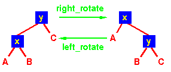

# RBTree([原文地址](https://www.cs.auckland.ac.nz/software/AlgAnim/red_black.html))

红黑树是是一棵附带颜色属性(黑或红)的二叉搜索树(BST)。结构如下：

```
struct t_red_black_node {
    enum { red, black } colour;
    void *item;
    struct t_red_black_node *left,
                     *right,
                     *parent;
    }
```

## 定义

RBTree是拥有如下特性的BST：

1) 任何一个节点要么红、要么黑
2) 叶子为黑
3) 若某节点为红，则其子节点皆为黑
   <br>隐含：从根到某个叶子的途经的红节点必不相邻
4) 从任何节点到叶子的所有路径经过相同个数的黑节点


引理：
拥有n个内部节点的RBTree的高度最高为：2 * log(n + 1)
<br>(证明见：Cormen, p 264)

这意味着，BRTree的搜索时间复杂度为O(logn)

## 操作

* 旋转
  
    
  <br>旋转是BRTree的内部操作，维持原有遍历次序。如上图所示，左旋转、右旋转皆未破坏二叉树的中序遍历结果：a->x->b-y->c

* 插入  
* 删除

待续。